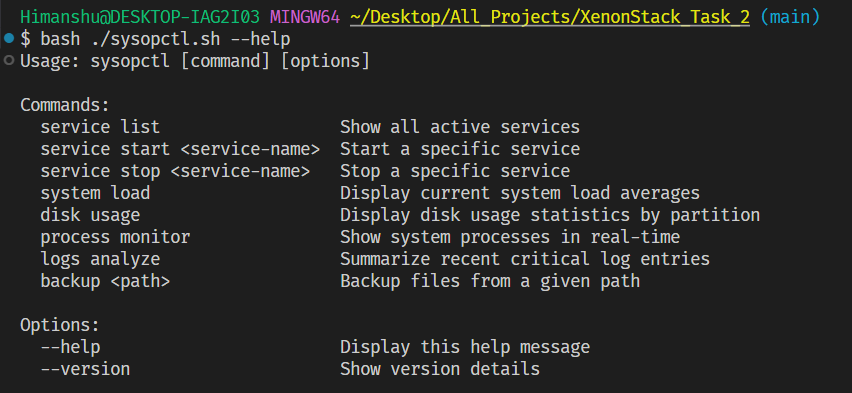
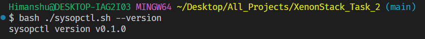
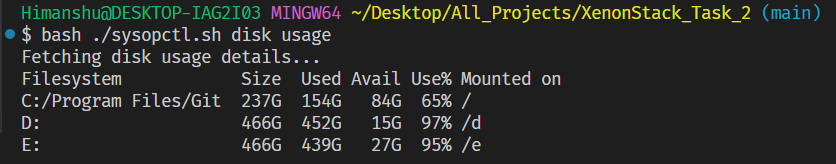

# Xenonstack Task 2: Command-Line Utility (sysopctl)

**sysopctl** is a custom Linux command-line utility designed to streamline system administration tasks, including managing services, processes, system load, disk usage, and system logs. It provides a simple and intuitive interface to manage key system resources and is highly effective for administrators looking for quick control over their environment.

## Features

- **Service Management**:
  - List all active services.
  - Start or stop any specified service.
- **System Monitoring**:

  - Display current system load averages.
  - Monitor system processes in real-time.
  - Analyze recent critical log entries.

- **Disk and Backup Operations**:
  - View disk usage statistics.
  - Backup files from a specified directory.

## Command Overview

| Command                         | Description                                                                |
| ------------------------------- | -------------------------------------------------------------------------- |
| `sysopctl --help`               | Displays usage information.                 |
| `sysopctl --version`            | Shows the version of the command.           |
| `sysopctl service list`         | Lists all active system services.                                          |
| `sysopctl service start <name>` | Starts the specified service.                                              |
| `sysopctl service stop <name>`  | Stops the specified service.                                               |
| `sysopctl system load`          | Displays the system's current load averages.                               |
| `sysopctl disk usage`           | Displays disk usage statistics by partition.  |
| `sysopctl process monitor`      | Monitors real-time system processes.                                       |
| `sysopctl logs analyze`         | Analyzes and outputs critical log entries from recent activities.          |
| `sysopctl backup <path>`        | Backs up files from the specified directory using `rsync`.                 |

## Installation

Clone the repository to your local system:

```bash
git clone https://github.com/himanshuarya3110/Xenonstack-Task2
```
